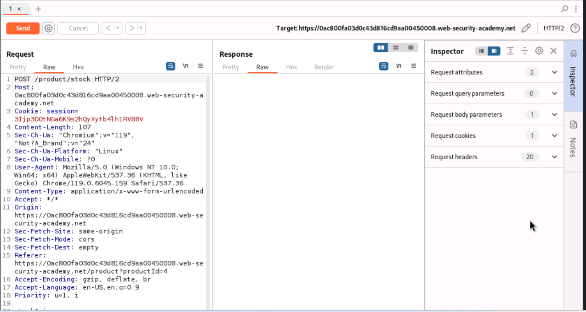
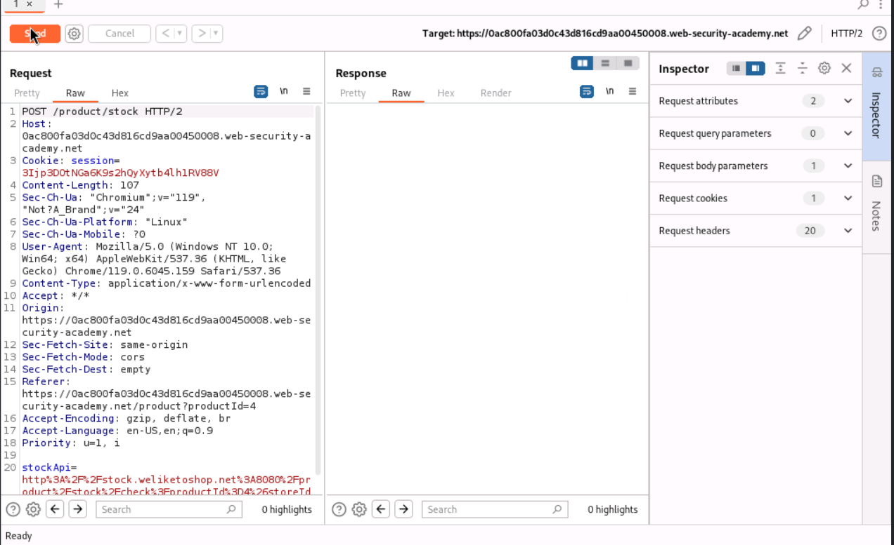
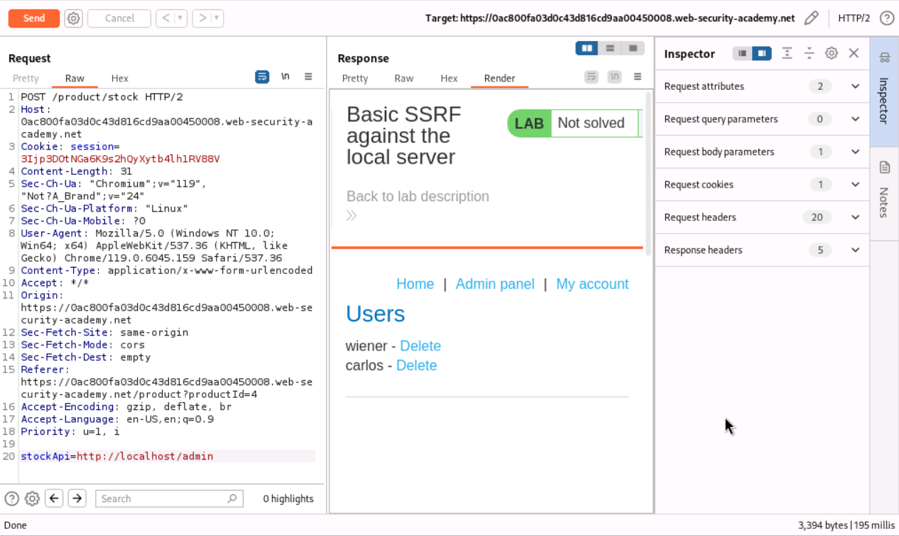
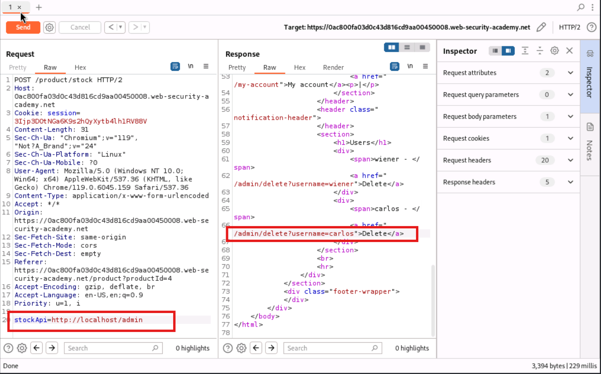
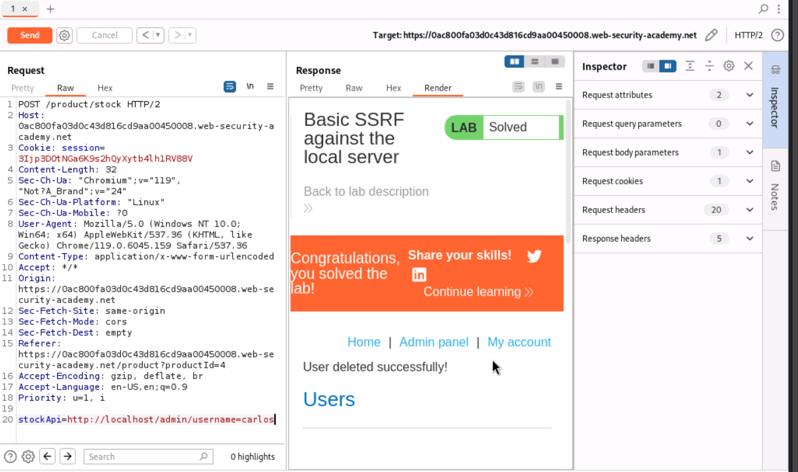

# SSRF Lab 1 - Basic SSRF Against the Local Server

Platform: PortSwigger Web Security Academy
Status: Solved

The lab has a shop website with a "check stock" feature on each product. This feature makes a request to a stock API in the background to check if the item is in stock.

**Step 1 - checking normal behaviour**

I clicked check stock on a product and intercepted the request in Burp Suite. In the request body there was a parameter called stockApi which had a full URL in it, pointing to an external stock checking service:

stockApi=http://stock.weliketoshop.net:8080/product/stock/check?productId=4&storeId=...

This means the server is taking this URL and going and fetching it on the backend. So this is the injection point for SSRF.

**Step 2 - redirecting the request internally**

Instead of the external stock API url, I changed the stockApi value to point to the local admin panel:

stockApi=http://localhost/admin

Sent this using Repeater and the response actually rendered the whole admin panel html, with a list of users (wiener and carlos) and a delete option next to each one. This confirms SSRF is working - the server is fetching an internal page for me and returning it back, even though I should not have access to /admin directly.

**Step 3 - finding the delete link**

The Render tab in Burp doesn't let you click/inspect links properly so I checked the Raw response tab instead and found the exact delete link for carlos:

<a href="/admin/delete?username=carlos">Delete</a>

**Step 4 - deleting the user through SSRF**

Changed the stockApi parameter again to point directly to the delete endpoint:

stockApi=http://localhost/admin/delete?username=carlos

Sent it and got "User deleted successfully!" in the response, and the lab status changed to Solved.

**Observation**

The app just trusts whatever URL is put into the stockApi parameter and fetches it on the server side, without checking if it's actually the real stock API domain or not. Since the request is coming from the server itself, it can reach internal pages like /admin that shouldn't normally be reachable from outside. This is basically what SSRF is - using the trusted server as a proxy to reach internal stuff it has access to but I don't.

**How this could be fixed**

- Only allow the stockApi parameter to point to the actual trusted stock API domain (whitelist it)
- Better, don't accept a full URL from the user at all - just take a product/store id and build the internal request from that on the server side
- Block the app server from being able to reach sensitive internal endpoints like /admin in the first place, at the network level
