# SSRF Lab 2 - Basic SSRF Against Another Back-End System

Platform: PortSwigger Web Security Academy
Status: Solved

This lab has the same stock check feature as before, but this time the internal admin interface isn't just at localhost - it's somewhere on an internal network (192.168.0.X range) and I need to find which IP it's actually on.

**Step 1 - checking the request**

Intercepted the check stock request again, same as lab 1. This time the stockApi parameter pointed to an internal IP instead of a domain:

stockApi=http://192.168.0.1:8080/product/stock/check?productId=4&storeId=1

Decoded it in the Inspector panel to confirm the exact value being sent.

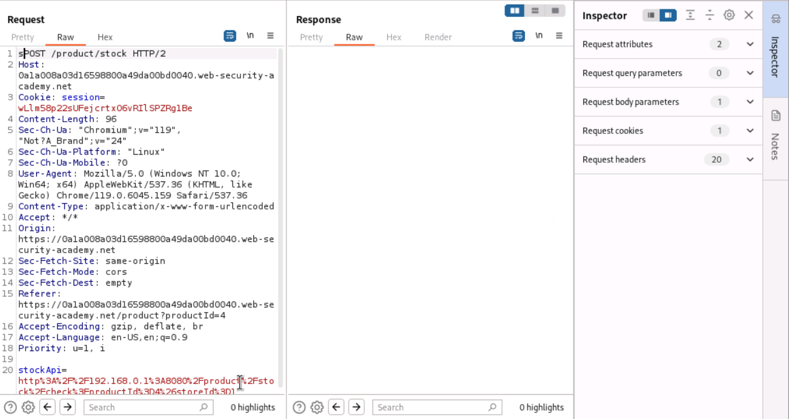
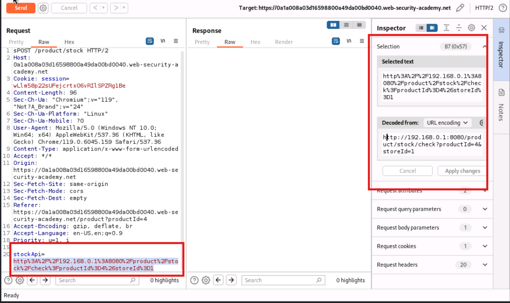

**Step 2 - setting up Intruder to scan the range**

Since the admin interface could be on any IP in 192.168.0.1 to 192.168.0.255, I sent the request to Burp Intruder to automate checking every address on port 8080 with /admin as the path.

- Marked the last octet of the IP as the payload position
- Set payload type to Numbers, From 1, To 255, Step 1

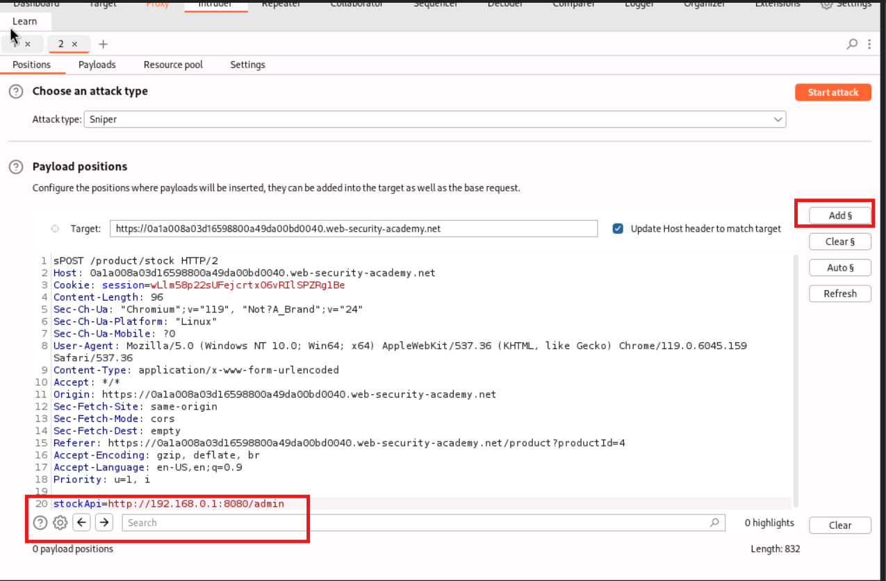
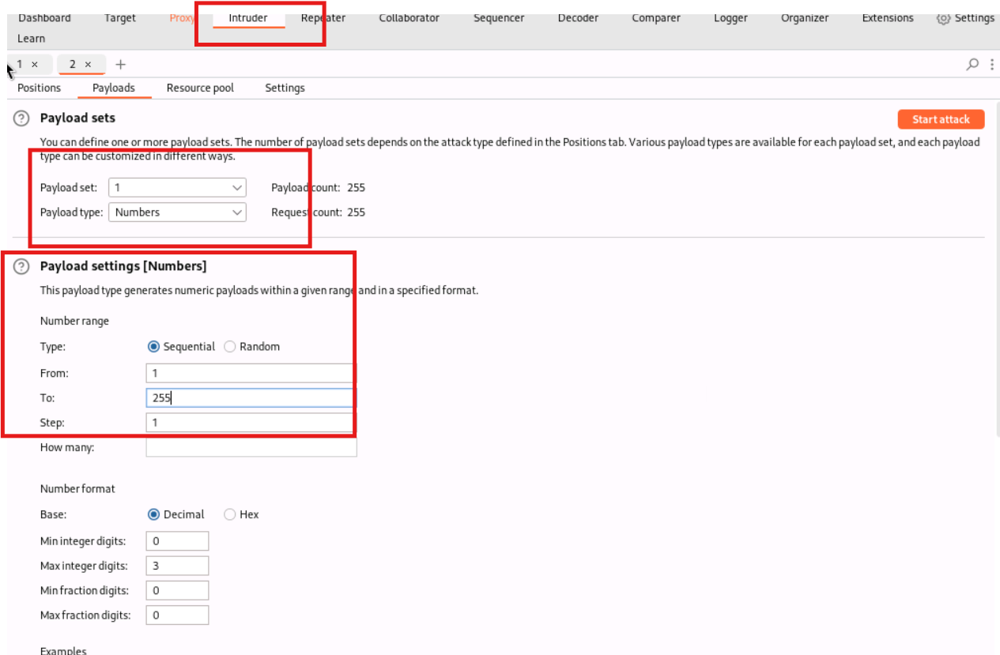

**Troubleshooting along the way**

Ran into a few issues before getting a proper scan running:

- First attempt had a stray character at the start of the request line (sPOST instead of POST) which caused every request to fail the same way
- Fixed that, but then every request came back with an Error instead of a status code - turned out Burp's proxy listener had a port conflict and wasn't capturing browser traffic properly, so the session in use had gone stale
- Fixed the proxy listener port and got a fresh session by reloading the lab and clicking check stock again
- After that, results started coming back with a consistent status 500 across the board - noticed the stockApi payload was missing the :8080 port after inserting the payload marker, so it was hitting default port 80 on every IP instead

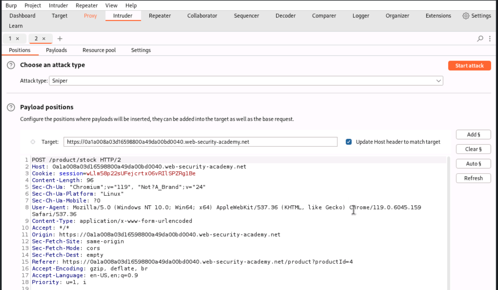
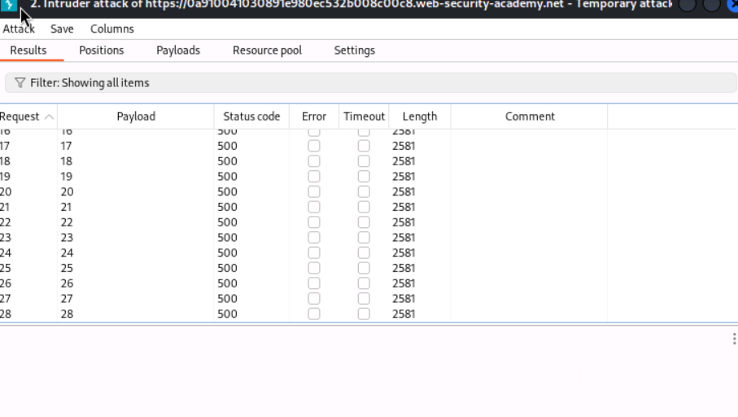
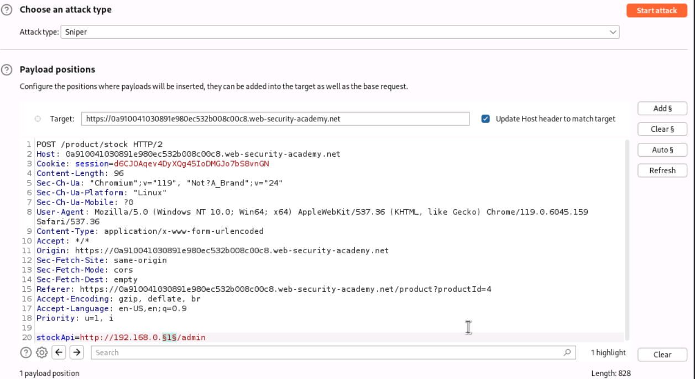

**Step 3 - results (in progress)**

After fixing the port issue, the scan started returning different status codes and lengths for different IPs (request 0 and 1 came back as 400 with length 141, rest were 500 with length 2581) which is a good sign that something's actually distinguishing between reachable and unreachable IPs.

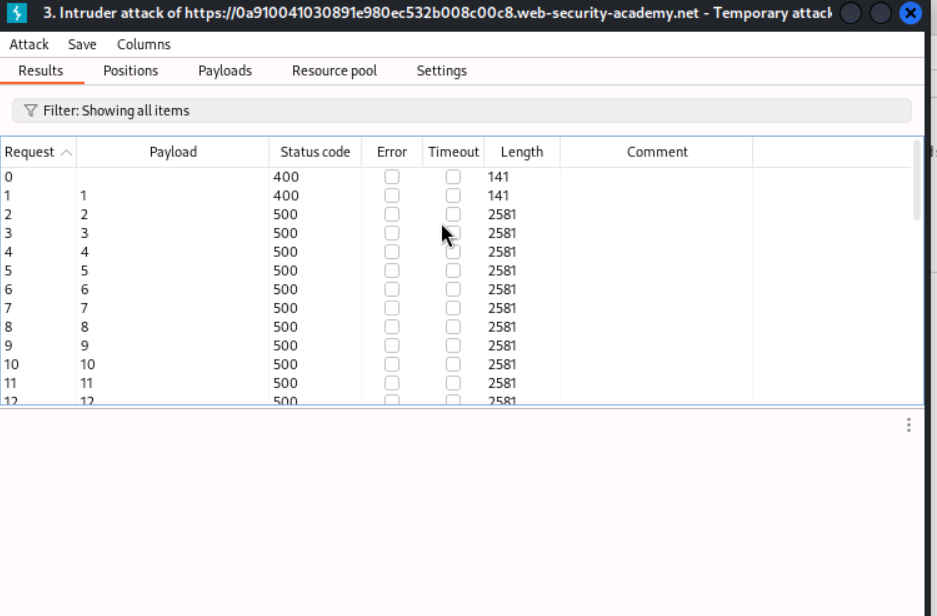

**Step 4 - found the right IP**

Sorted the results by Length once the full scan finished. Request 127 stood out clearly - status 200 and length 3378, while literally everything else was status 500 with length 2581. That means the internal IP 192.168.0.127 on port 8080 is the one actually running the admin interface.

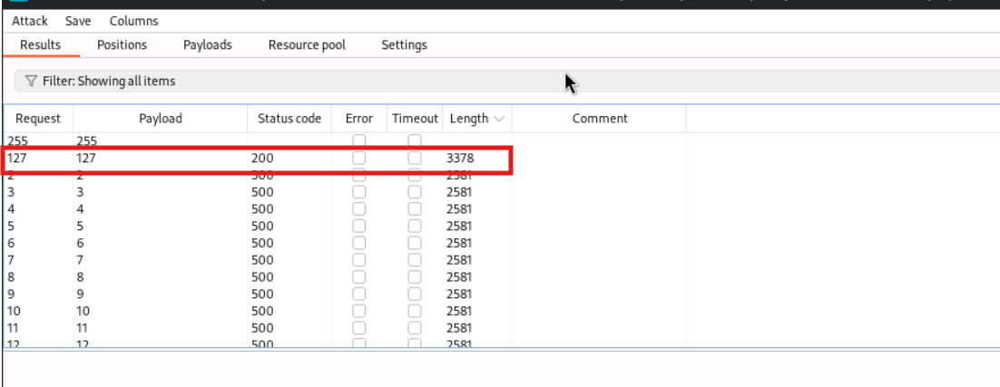

**Step 5 - finding and hitting the delete endpoint**

Sent the request 127 result to Repeater to confirm it actually rendered the admin panel. Then tried to jump straight to the delete action for carlos, but got a 404 the first time because I used a slash instead of a ? before the username parameter (typed /admin/delete/username=carlos instead of /admin/delete?username=carlos).

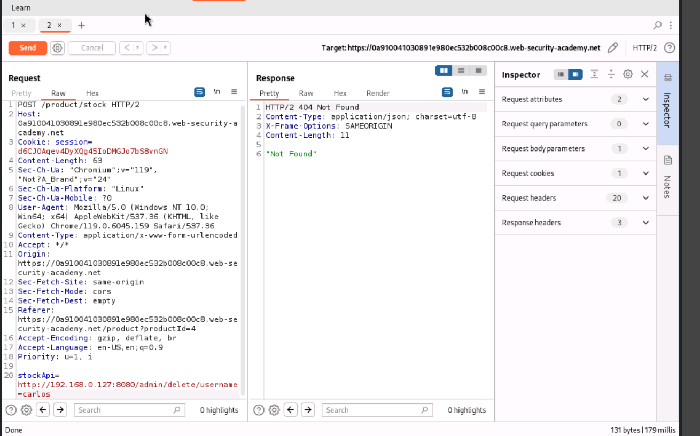

Fixed the payload to:

stockApi=http://192.168.0.127:8080/admin/delete?username=carlos

This came back as a 302 redirect to the admin panel, which usually means the action went through and it's just redirecting back.

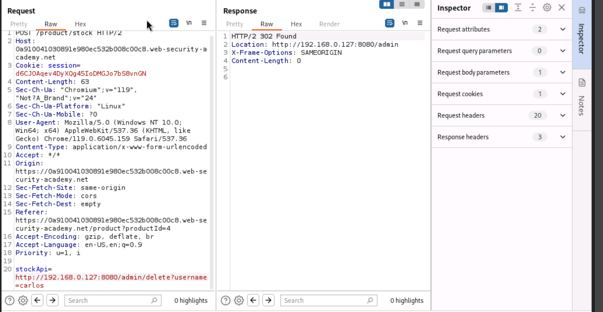

To confirm, sent one more request just to http://192.168.0.127:8080/admin (no delete path) and the response showed "User deleted successfully!" with only wiener left in the Users list - carlos was gone. Lab status flipped to Solved.

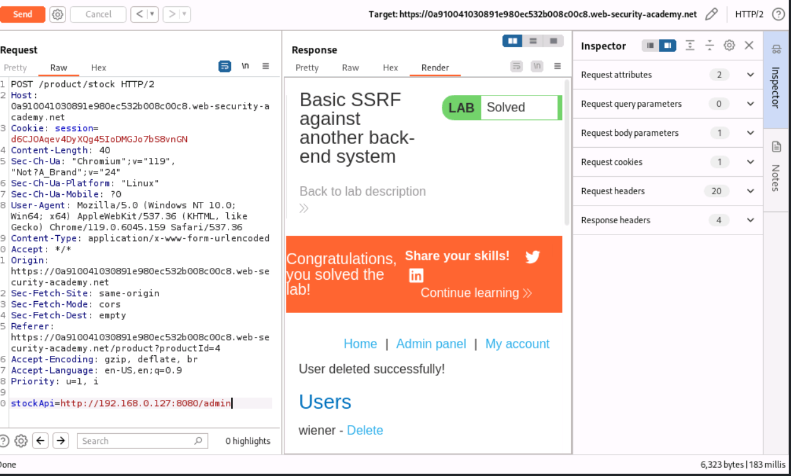

**Observation**

Same root cause as Lab 1 - the app blindly trusts a user-controlled URL in the stockApi parameter, except this time the vulnerable internal target wasn't at a predictable address like localhost, it was somewhere on an internal 192.168.0.X network. Using Burp Intruder to brute-force the IP octet made it possible to find the one address (192.168.0.127) that actually had something listening on port 8080, just by comparing response length and status code against the rest of the range.

This shows SSRF isn't limited to just hitting localhost - if an app can be tricked into making requests to attacker-chosen destinations, an attacker can effectively port/IP scan an internal network from outside, discovering and reaching machines that were never meant to be internet facing.

**How this could be fixed**

- Whitelist the exact internal hosts/ports the stockApi parameter is allowed to reach, instead of accepting any internal IP
- Segment the network so the application server itself cannot reach arbitrary internal hosts like the admin interface at all
- Don't accept a raw URL from the client in the first place - resolve internal service locations server-side from trusted config, not user input
